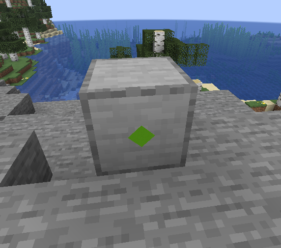

!!! abstract "Author: Seggan"

Remember when your mom told you not to stick that fork in the outlet? Well I did, and it was not pleasant.

## Electric nodes

The basic unit of an electric network is the electric node. Electric nodes, at their most basic, are simply objects with an ID and a list of other IDs it connects to. There are four types of node:

### Connector nodes
These are the most basic type, having no other information besides connections.

### Producer nodes
These have a property that defines how much power they produce, as a continuous value in watts.

### Consumer nodes
These have a property that defines how much power it needs. There is also a read only property `isPowered` that is only true if the consumer is getting that much power (more on that later).

### Acceptor nodes
Conceptually similar to consumer nodes except that they have a callback called with a given amount of power instead of requesting a certain amount, and they are prioritized after consumers; i.e. they only get surplus power consumers didn't consume. This is in order to both make the routing code simpler and to allow caching of consumers to make UNLIMITED SPEED BRRRRRRRRRRRRRRRRRRRR

## Electric networks
An electric network is just the set of all nodes that are connected to at least one other node in the set. Each edge between nodes can have one of two properties: a power limit and unidirectionality. The power limit limits how much power can flow through that edge, and unidirectionality only allows electricity to flow through that edge in one direction.

## Network ticking
The electricity tick is split into three parts: the consumer tick, the acceptor tick, and the producer tick. Every tick, the network first checks if there is a consumer snapshot; if there is, it skips the consumer tick and goes straight to the acceptor tick. Otherwise, it first executes the consumer tick, stores the results in a new snapshot, and then only executes the acceptor tick.

### Consumer snapshots
This is the main performance-increasing part of the electric tick. Since producers and consumers specify *power* (watts) instead of *energy* (joules), electricity can be modeled as a flow instead of discrete units. Thus, assuming that production and consumption does not change, the result of the flow calculations can be cached until the inputs *do* change, greatly improving performance.

This however does not work with acceptors&mdash;since acceptors take in a discrete amount of electricity, do a black-box thing to it (this is the important bit), and output a discrete amount, the results cannot be cached as they may change at any moment. Thus, the acceptor tick always runs, no matter the state of the snapshot. Since most electric machines are modeled as consumers instead of acceptors[[*citation needed*](https://xkcd.com/285/)], the snapshot system should still greatly help with performance.

### Pathfinding
In order to distribute power from producers to consumers, the code uses a greedy best-first search. The network keeps a heuristic map, which basically assigns each node a number based on how far (how many edges it needs to follow in the network) it is to a given consumer. Since this heuristic is perfect (i.e. it always gives an accurate distance to the goal), the greedy best-first search always follows the lower number first when searching, and, except in cases of unidirectionality or a hit power limit, always finds the optimal path without exploring any extra nodes.

### Consumer tick
1. Set every consumer requiring more than 0 energy to unpowered.
2. Assign power to consumers using a round robin bucket fill: distribute equal amounts of energy from the total. If any consumer is assigned more energy than it requires, distribute the surplus among the rest.
3. If any consumer does not have enough power assigned to it, remove the consumer that requires the least amount of power and go back to step 2. Otherwise, proceed to step 4.
4. Assign "power taken" values to producers using the same round robin bucket fill algorithm, except using the power production as the limit.
5. For every consumer:
    1. For every producer available:
        1. Pathfind from the producer to consumer. If there is no path from this producer to this consumer, go to the next producer. If there are no paths from any producer to this consumer, abandon the attempt and go to the next consumer.
        2. Determine the actual amount of power that can travel from the producer to the consumer, using edge limits and edge loads (power already going through the network).
        3. Update edge loads with the power delivered. If any edges have hit their limit, temporarily disconnect them so pathfinding won't see them.
        4. If the consumer is unsatisfied, continue with the next producer, otherwise set it to powered and continue with the next consumer.
6. Calculate the amount of surplus power available after doing the distribution.
7. Update the consumer snapshot with the surplus power, edge loads, and disconnected edges.

### Acceptor tick
Conceptually similar to the consumer tick:

1. Take the surplus power, edge loads, and disconnected edges from the snapshot.
2. For every acceptor:
    1. Allocate an even amount of energy from the surplus for this acceptor.
    2. For every producer available:
        1. Pathfind from the producer to acceptor. If there is no path from this producer to this acceptor, go to the next producer. If there are no paths from any producer to this acceptor, abandon the attempt and go to the next acceptor.
        2. Determine the actual amount of power that can travel from the producer to the acceptor, using edge limits and edge loads.
        3. Update edge loads with the power delivered. If any edges have hit their limit, temporarily disconnect them so pathfinding won't see them.
        4. Call the acceptor's callback with the delivered power.
        5. If the acceptor still has allocated energy left, continue with the next producer. Otherwise continue with the next acceptor.

### Producer tick
This just notifies the producers of how much energy was consumed that tick.

## Electric blocks
You may have noticed a suspicious absence of Minecraft related terms in this article, such as "block" and "item" and "waxed weathered cut copper stairs". This is because electric blocks are completely separate from electric networks. The main reason is that electric blocks can and often do hold more than one electric node. The job of the electric block is twofold: hold nodes and hold ports. What is a port you ask? Well it's a physical representation of an electric node. As of the time of writing, it is represented by a square rotated by 45 degrees, like this consumer node:

Ports also have secret interaction entities that allow you to connect wires to them. 

### `SimpleElectricRebarBlock`
Allow me to quote the Javadoc:
>  In a SimpleElectricRebarBlock, all electric nodes created are connected to each other. This allows the abstraction of the concept of "nodes" into a general "electric block" that can have any number of connectors, producers, and consumers without needing to worry about full interactions, while also providing simple utility methods for interacting with the electricity system.
 
 
Each node is named consecutively by its type starting from 0. For example, if you create two producer nodes and one consumer node, they will be named "producer_0", "producer_1", and "consumer_0", respectively. All interaction methods/properties will only interact with the zeroth node of each type, so in this example, the "producer_0" and "consumer_0" nodes. Since all nodes in a block are interconnected, this means the "producer_1" node produces 0 power by itself, but allows power to flow from "producer_0" into itself, thereby allowing it to power other blocks as well.

