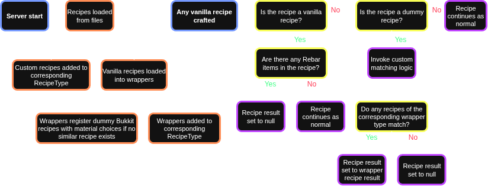
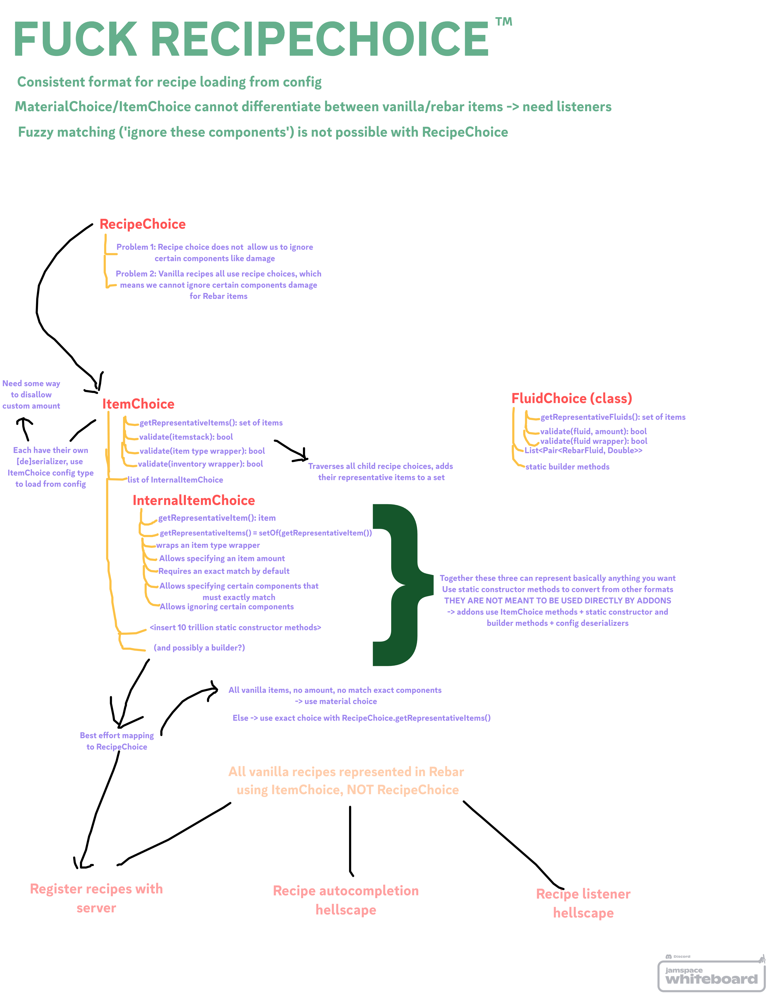

# RECIPE HELLSCAPE

!!! abstract "Author: Idra"
    (Note: Justin wrote most of the vanilla recipe handling logic)

!!! danger
    !!! danger
        !!! danger
            !!! danger
                !!! danger
                    Welcome, mortal being, to the realm of madness. Here be dragons. Leave your light at the door, for otherwise you may uncover things in the shadows you never wished to see

---

## The problems

### RecipeChoice primer

In Rebar, we need to add new recipes to vanilla things, like the crafting table, furnace, etc. Easy right? Bukkit has a nice API which allows us to register new recipes with the server. When we register recipes, we need to provide a RecipeChoice. This is a sealed interface. The only available implementations are ExactChoice, MaterialChoice, and ItemTypeChoice (which is basically just MaterialChoice). 

- ExactChoice matches an item exactly. If anything at all is different (name, tool durability, even pdc contents, etc), it will fail to match.
- MaterialChoice and ItemTypeChoice match a material or a set of materials. They do not care about anything else like tool durability left, name, etc.

### Problem 1: Rebar items in vanilla recipes

Rebar uses items' PersistentDataContainer to keep track of the Rebar item type. This means that, guess what, MaterialChoice and ItemTypeChoice will match Rebar items. For example, a tin ingot is backed by an iron ingot. So, if you place a tin ingot in a crafting grid, the iron nugget recipe will match (because it uses a material choice) and you will be able to happily convert your tin ingot into iron nuggets. This is less than ideal.

### Problem 2: Bukkit recipe choices and fuzzy matching

Obviously, MaterialChoice and ItemTypeChoice are instantly off the table for any recipes involving Rebar items without some kind of extra recipe handling logic. So we can only really use ExactChoice. This is very limiting. For example, what if we want to allow using a bronze pickaxe with any amount of durability in a recipe?

We could try to use a MaterialChoice and then add a listener which corrects the output whenever someone attempts to register a recipe. But continuing with the bronze pickaxe example, the bronze pickaxe's backing item is a gold pickaxe. So if we want to allow using either a gold pickaxe or a bronze pickaxe, well, we have a problem. And there are other edge cases not mentioned here.

By now, your brain might be exploding. This is expected.

### Problem 3: Rebar recipe API

We need some kind of nice API which allows addons to create recipes. How do we specify recipe inputs in this API? We could re-use Bukkit's RecipeChoice and force ExactChoice to always be used. But this causes the same problems as above.

So, we could create our own API for adding recipes and keep using RecipeChoice for crafting recipes. But now we have two different formats for specifying recipe inputs, and everything needs to be adjusted to potentially work with both. On top of that, our custom recipe input type would require separate config adapters from recipe choices, leading to inconsistencies in configs.

Clearly, we would ideally want to have one unified API for specifying vanilla and Rebar recipes.

### Problem 4: Recipe autocompletion HELLSCAPE

Rebar does not like the recipe book. This is because while we can, for example, listen to crafting events and hijack the logic to partially solve the above problems, the recipe book is mostly clientsided. So even if we for example fix the output of the crafting table to prevent rebar items from being used in vanilla recipes, this will not translate to the recipe book.

---

## The solutions

### SIMPLIFIED summary diagram

### Unified API

Rebar has one API for handling both vanilla and custom recipes. It's important to understand how tf this works to understand the rest of this page. There are several main components:

!!! info "FluidChoice"
    'At least X amount of A, B, or C fluids'

    Has an associated config adapter FluidChoiceConfigAdapter

!!! info "ItemChoice"
    'At least X amount of A, B, or C items'

    Each possible item is represented as an InternalItemChoice and can have an associated predicate. This allows for extra checks to be done e.g. check all components of a bronze pickaxe are the same except for the remaining durability. A builder `ItemChoice.Builder` allows easy(ish) construction of ItemChoices.

    Has an associated config adapter ItemChoiceConfigAdapter.

!!! info "FluidOrItemChoice"
    A sealed interface implemented by both FluidChoice and ItemChoice, allowing you to represent both using one object.

!!! info "RebarRecipe"
    Represents one recipe of a given RecipeType.

!!! info "RecipeType"
    Represents one type of recipe, such as pipe bending recipes, table saw recipes, etc.

    Contains a list of all of the corresponding RebarRecipes.

!!! info "ConfigurableRecipeType"
    RecipeType, except with a loadRecipe method which attempts to load recipes from a config section. Recipes are loaded from the corresponding file using loadRecipe on startup.

### Vanilla recipe representations

We need some way to store the vanilla recipes. To do this, Rebar has its own representations of vanilla recipe types. These can be found in the 'recipe.vanilla' package.

### Recipe result hijacking

Bukkit provides events for whenever a recipe is attempted or prepared. We listen to all of these events, and if there are any Rebar items present in the recipe inputs, we apply our own matching logic (detailed shortly) and manually override the result to either be null, or the correct output.

In practice, this is more complicated because of a large number of edge cases and other behaviours that must be accounted for, such as two bronze pickaxes being merged.

The logic for this is contained almost entirely within RecipeListener.

### Manual vanilla recipe matching

As mentioned above, if there is a Rebar item in a vanilla recipe, we need to invoke our own matching logic. This is because the vanilla matching logic cannot (as discussed previously) flexibly match Rebar items due to the limitations of RecipeChoice. To do this, we have a big file RecipeMatchingService containing utility methods to match every type of vanilla recipe that we process.

### Dummy recipes

There is a problem with recipe result hijacking which has been conveniently left out of the previous discussion. Consider a recipe for a machine added by a Rebar addon which has no corresponding similar vanilla recipe. If such a recipe is crafted in *some* contexts, such as in a furnace or a crafter

- ...we have neglected to register the recipe in favour of our own matching logic...
- ...and so no recipe matches the contents of the crafting grid...
- ...and so no event is fired.

!!! note 
    Dummy recipes are not required for every recipe type. For example, crafting tables fire an event whenever their input is updated which we can take advantage of.

To mitigate this, when a Rebar recipe does not have a vanilla equivalent (i.e. a recipe which uses all the same backing materials - think tin ingot -> tin nugget and iron ingot -> iron nugget), we register dummy recipes. These are recipes which use a MaterialChoice of the corresponding Rebar item's backing material for all of their inputs. Now, when the recipe for a hydraulic pipe bender is placed into a crafting table...

- ...the dummy recipe will match...
- ...the event will fire...
- ...and we'll intercept the event...
- ...and we'll do our own matching to ensure that the items in the crafting grid actually match the recipe

This can be thought of as registering a recipe with weaker constraints (i.e. it might match stuff that's not in the recipe) and then enforcing a stronger constraint (ensuring the recipe exactly matches) when we intercept the event.

### Client recipe book gaslighting

Remember how the recipe book is *mostly* clientsided? There is a PlayerRecipeBookClickEvent which is fired when the player attempts to complete a recipe using the recipe book.

TODO

---

## Appendix

### Original whiteboard planning out the system

[PersistentDataContainer]: https://jd.papermc.io/paper/1.21.11/org/bukkit/persistence/PersistentDataContainer.html
[RecipeChoice]: https://jd.papermc.io/paper/26.1.2/org/bukkit/inventory/RecipeChoice.html
[ExactChoice]: https://jd.papermc.io/paper/26.1.2/org/bukkit/inventory/RecipeChoice.ExactChoice.html
[ItemTypeChoice]: https://jd.papermc.io/paper/26.1.2/org/bukkit/inventory/RecipeChoice.ItemTypeChoice.html
[MaterialChoice]: https://jd.papermc.io/paper/26.1.2/org/bukkit/inventory/RecipeChoice.MaterialChoice.html

