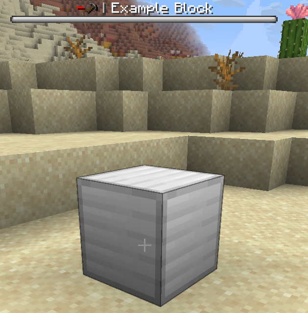

# Custom blocks

!!! warning "This section of the docs assumes you understand the basics of Rebar items."

Adding a custom block requires 3 things:

- A block class
- A `NamespacedKey` that identifies your block
- A corresponding `RebarItem` (Not strictly needed, but recommended so players can place your block)


## Block classes

In Rebar, each type of block has its own class. Instances of that class represent blocks in the world. For example, there is an instance of the `WaterPump` class for every single loaded water pump in the world.

Each block class needs two constructors: the 'place' constructor (called when the block is placed) and the 'load' constructor (called when the block is loaded).

Below is a very simple example of a block class which doesn't do anything interesting.
```java title="ExampleBlock.java"
public class ExampleBlock extends RebarBlock implements RebarInteractBlock {

    // 'Place' constructor - called when the block is placed down
    public ExampleBlock(@NonNull Block block, @NonNull BlockCreateContext context) {
        super(block, context);
    }

    // 'Load' constructor - called when the block is loaded
    public ExampleBlock(@NonNull Block block, @NonNull PersistentDataContainer pdc) {
        super(block, pdc);
    }
}
```


## Registering blocks

Registering a block is straightforward. First, we need to create a key:
```java title="ExampleAddonKeys.java"
public class ExampleAddonKeys {
    public static final NamespacedKey EXAMPLE_BLOCK = new NamespacedKey(ExampleAddon.getInstance(), "example_block");
}
```

Next, we can register the block:
```java
RebarBlock.register(ExampleAddonKeys.EXAMPLE_BLOCK, Material.IRON_BLOCK, ExampleBlock.class);
```

!!! note "Blocks should be registered from your addon's `onEnable` method."
    We recommend creating a separate file which handles registering all your blocks, to avoid your `onEnable` function becoming huge.

Registering a block does not register a corresponding item for the block. We will need to register a corresponding item so that players can get the block as an item. Usually, the same key is used for the item and the block. As our item does not need any special behaviour, we will just use the `RebarItem` class for the item:
```java title="ExampleAddonItems.java"
public static final ItemStack EXAMPLE_BLOCK = ItemStackBuilder.rebar(Material.IRON_BLOCK, ExampleAddonKeys.EXAMPLE_BLOCK)
        .build();
```

```java
// Register a 'normal' item which represents Example Block
// Blocks and their corresponding item will almost always share the same key
// Note the 3rd parameter - this is the key of the corresponding block registered in [ExampleAddonBlocks]
RebarItem.register(RebarItem.class, EXAMPLE_BLOCK, ExampleAddonKeys.EXAMPLE_BLOCK);
PylonPages.MISCELLANEOUS.addItem(EXAMPLE_BLOCK);
```

We also need language file entries for the item:
```yaml title="en.yml"
item:
  example_block:
    name: "Example Block"
    lore: |-
      <arrow> An example block
```

This is all that is required to add a simple custom block.




