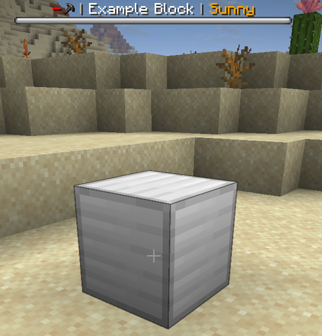
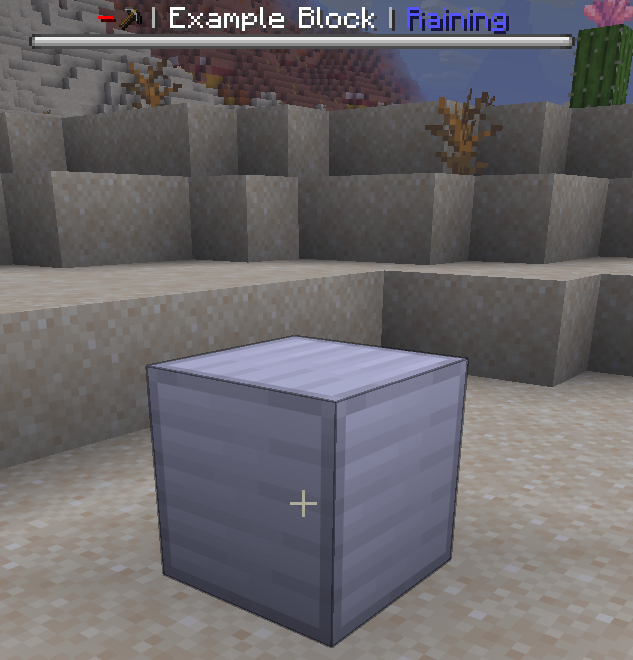
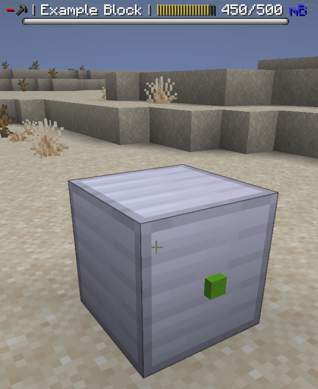
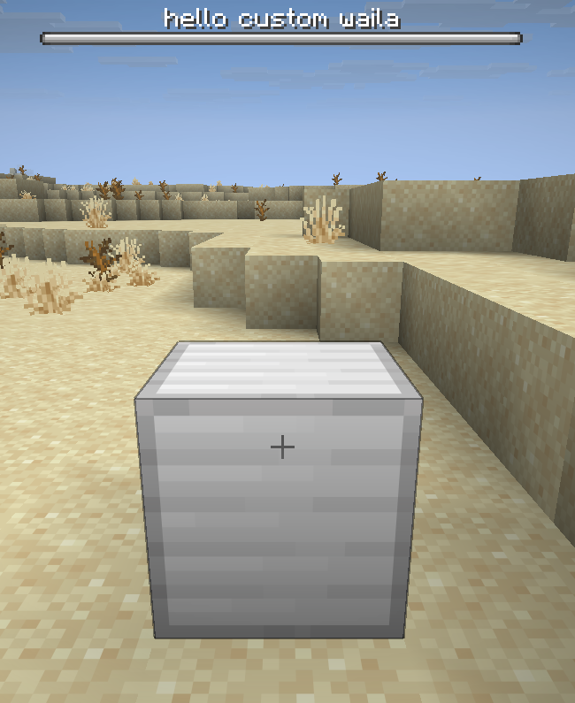

WAILA (What Am I Looking At) shows information about the Rebar block you are looking at:

{ width="400" }

By default, a block will simply display its name in WAILA (along with the given tool and tool status if the block has a preferred tool).

{ width="400" }


## Customising the WAILA display

You can override `getWaila` to change all aspects of your block's WAILA by returning a custom [WailaDisplay](https://pylonmc.github.io/rebar/docs/javadoc/io/github/pylonmc/rebar/waila/WailaDisplay.html). You can also return `null` to hide the WAILA.

```java title="ExampleBlock.java"
public class ExampleBlock extends RebarBlock {

    ...

    @Override
    public @Nullable WailaDisplay getWaila(@NotNull Player player) {
        return WailaDisplay.of(this, player);
    }
}
```

`getWaila` is continually called while the player is looking at your block to update their WAILA display.

---

### Adding segments to the WAILA

The default WAILA format is to have 'segments' separated by vertical lines. Each segment shows something different about the machine. You can call `add` on WailaDisplay to add a new segment.

The vast majority of blocks do not need to customise the WAILA display further than just adding new segments.

#### Example 1: Show weather in WAILA

```java title="ExampleBlock.java"
public class ExampleBlock extends RebarBlock {

    ...

    @Override
    public @Nullable WailaDisplay getWaila(@NotNull Player player) {
        boolean isSunny = getBlock().getWorld().isClearWeather();
        return WailaDisplay.of(this, player)
                .add(Component.translatable("pylon.item.example_block." + (isSunny ? "sunny" : "raining")));
    }
}
```

```yaml title="en.yml"
item:
  example_block:
    name: "Example Block"
    sunny: "<gold>Sunny"
    raining: "<blue>Raining"
```

{ width="400" }
{ width="400" }

#### Example 2: Show fluid contents of fluid tank in WAILA

```java title="ExampleBlock.java"
public class ExampleBlock extends RebarBlock implements FluidTankRebarBlock {

    ...

    @Override
    public @Nullable WailaDisplay getWaila(@NotNull Player player) {
        return WailaDisplay.of(this, player)
                .add(ProgressBar.fluidContents(getFluidType(), getFluidCapacity(), getFluidAmount()));
    }
}
```

{ width="400" }

---

### Changing bossbar style

If you want, you can change the color, overlay (how the boss bar looks), and progress of the bossbar. This obviously only affects players to be using the bossbar WAILA type, so you should not use the bossbar to communicate critical information.

```java title="ExampleBlock.java"
public class ExampleBlock extends RebarBlock {

    ...

    @Override
    public @Nullable WailaDisplay getWaila(@NotNull Player player) {
        // Use the .of method which takes a block and a player to get the default WAILA
        return WailaDisplay.of(this, player)
                // ...and then you can customise it as you wish
                .color(BossBar.Color.BLUE)
                .overlay(BossBar.Overlay.NOTCHED_12)
                .progress(0.8F);
    }
}
```

{ width="400" }

---

### Completely custom WAILA

You can completely customise the WAILA text by simply passing a component to `WailaDisplay.of(...)`.

```java title="ExampleBlock.java"
public class ExampleBlock extends RebarBlock {

    ...

    @Override
    public @Nullable WailaDisplay getWaila(@NotNull Player player) {
        return WailaDisplay.of(Component.translatable("pylon.item.example_block.custom_waila"));
    }
}
```

{ width="400" }

### WAILA overrides

TODO
