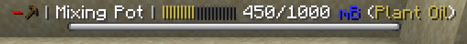
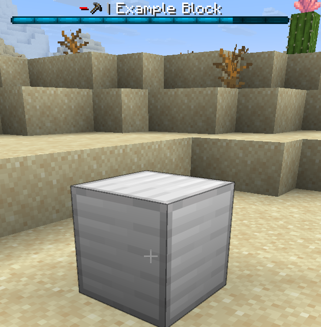

WAILA (What Am I Looking At) shows information about the Rebar block you are looking at:



By default, a block will simply display its name in WAILA:


## Set custom WAILA text

You can set the WAILA text by adding a `waila` key to `en.yml`:

```yaml title="en.yml"
item:
  example_block:
    name: "Example Block"
    lore: |-
      <arrow> An example block
    waila: "Some new WAILA"
```


## Overriding `getWaila`

You can override `getWaila` to change all aspects of your block's WAILA:
```java title="ExampleBlock.java"
public class ExampleBlock extends RebarBlock {

    ...

    @Override
    public @Nullable WailaDisplay getWaila(@NotNull Player player) {
        return new WailaDisplay(
                getDefaultWailaTranslationKey(), // Text (use the default text - equivalent to not overriding `getWaila` at all)
                BossBar.Color.BLUE, // Color
                BossBar.Overlay.NOTCHED_12, // Style
                0.2F // Progress
        );
    }
}
```




## Placeholders

Just like with items, you can supply placeholders to the WAILA text in the form of `RebarArgument`s:

```java title="ExampleBlock.java"
public class ExampleBlock extends RebarBlock {

    ...

    @Override
    public @Nullable WailaDisplay getWaila(@NotNull Player player) {
        return new WailaDisplay(
                getDefaultWailaTranslationKey().arguments(
                        RebarArgument.of("something", 666),
                        RebarArgument.of("another-thing", UnitFormat.MILLIBUCKETS.format(45))
                )
        );
    }
}
```

```yaml title="en.yml"
item:
  example_block:
    name: "Example Block"
    lore: |-
      <arrow> An example block
    waila: "Some new WAILA | %something% | %another-thing%"
```


