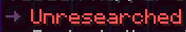
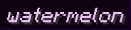
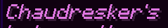

Rebar's language files make use of the [MiniMessage](https://docs.advntr.dev/minimessage/index.html) format. MiniMessage has many tags already built in, but Rebar adds new tags on top of that.

!!! info "See [tutorial 3](../../../creating-addons/tutorial-3.md) for a much more in-depth explanation of tags and how to use them."

## List of tags that Rebar adds

| Tag | Description | Example | Example result |
| :-- | :---------- | :------ | :----- |
| `<arrow>` `<arrow:[COLOR]>` | Inserts a right arrow (→) with the specified color (default: 0x666666) | `<arrow> Watermelon` |  |
| `<guidearrow>` | Shorthand for `<arrow:0x653d6d>`; used in the Rebar guide | `<guidearrow> Watermelon` |  |
| `<diamond>` `<diamond:[COLOR]>` | Inserts a diamond (◆) with the specified color (default: 0x666666) | `<diamond> Watermelon` |  |
| `<star>` `<star:[COLOR]>` | Inserts a star (★) with the specified color (default: NamedTextColor.BLUE) | `<star> Watermelon` |  |
| `<insn></insn>` | Applies a yellow styling (0xf9d104), used for instructions | `<insn>Right click</insn>` |  |
| `<guidehint></guidehint>` | Applies a light purple styling (0xeac5f4), used for guide hints | `<guidehint>Right click</guidehint>` |  |
| `<guideinsn></guideinsn>` | Applies a purple styling (0xc907f4), used for guide instructions | `<guideinsn>Right click</guideinsn>` |  |
| `<story></story>` |  Applies a light purple italic styling (0xde76e0), used for story text | `<story>Right click</story>` |  |
| `<attr></attr>` | Applies a cyan styling (0xa9d9e8), used for attributes | `<attr>Watermelons:</attr> 5` |  |
| `<unit:[unit]></unit>` `<unit:[prefix]:[unit]></unit>` | Formats a constant number as a unit, with an optional metric prefix | `<unit:seconds>1000</unit>` |  |
| `<nbsp></nbsp>` | Replaces spaces with non-breaking spaces, preventing line breaks | `<nbsp>Watermelon</nbsp>` |  |
| `<item:[item_name]>` | Renders the translated name of a vanilla/rebar item | `<item:pylon:bandage>` |  |
| `<entity:[entity_type]>` | Renders the translated name of an entity type | `<entity:creeper>` |  |
| `<effect:[effect_type]>` | Renders the translated name of a potion effect | `<effect:speed>` |  |
| `<enchant:[enchant_name]>` | Renders the translated name of an enchantment | `<enchant:sharpness>` |  |
| `<biome:[biome_name]>` | Renders the translated name of a biome | `<biome:plains>` |  |

