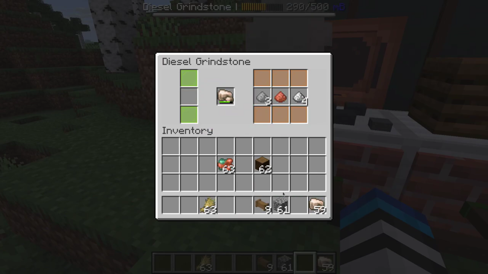
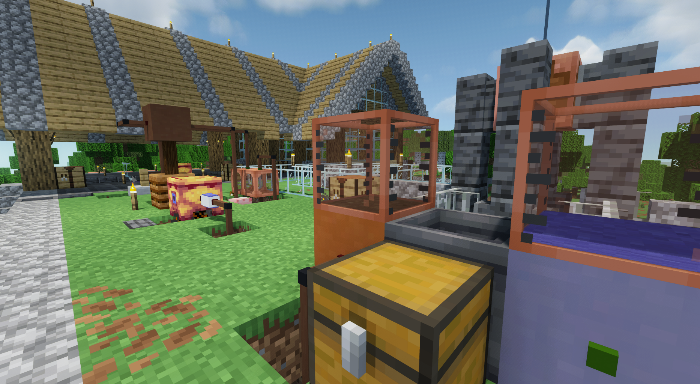
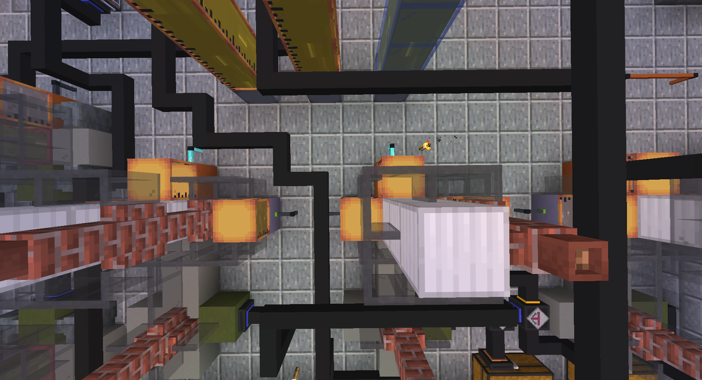
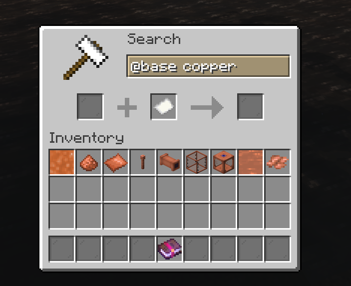
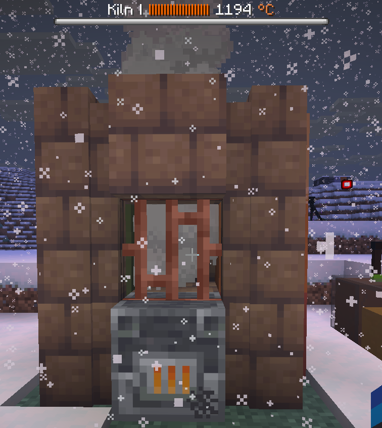
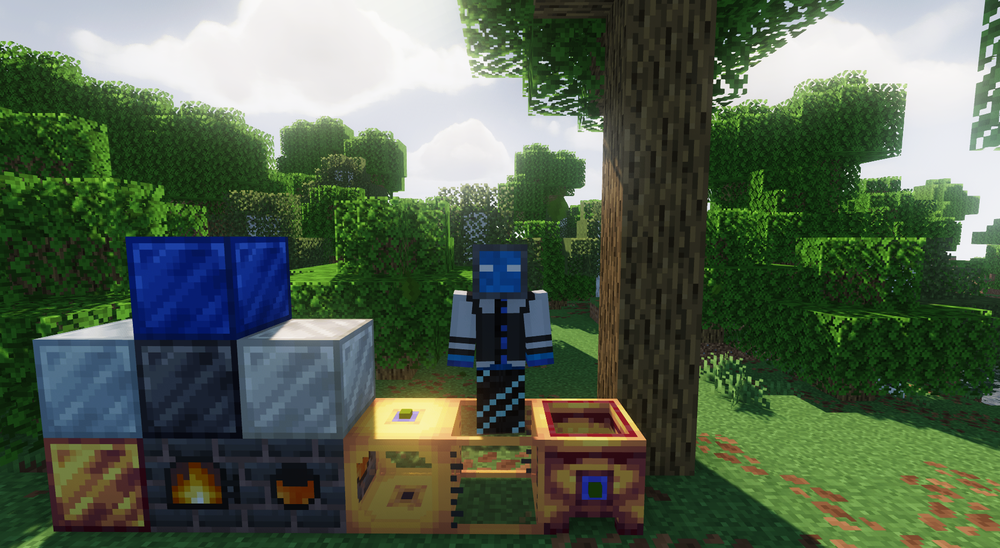
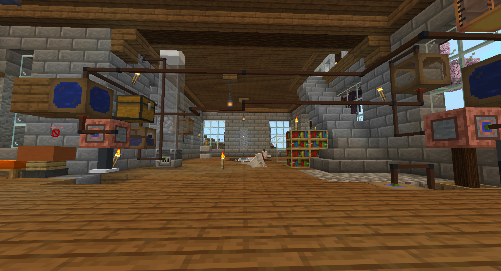
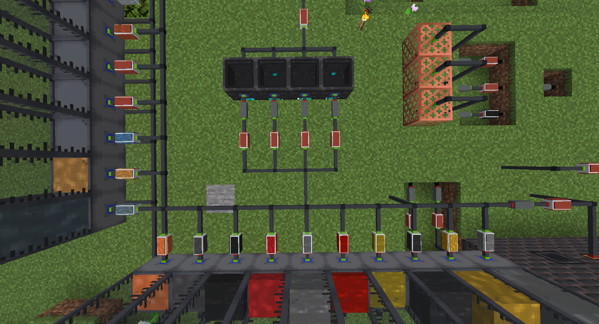

Pylon is an upcoming Minecraft Java technology plugin that will hugely expand vanilla gameplay with new content: electricity, diesel machines, new fluid pipes and fluids, logistics, useful tools and weapons, and much, much more!

Pylon is built using Rebar a powerful framework that allows adding custom blocks, items, researches, etc. Rebar also implements complex systems such as fluid handling logic and cargo routing. **Pylon is actually a Rebar addon**.

[:simple-discord: Join us on Discord :material-arrow-right:](https://discord.gg/4tMAnBAacW){ .md-button } [:simple-github: Find us on GitHub :material-arrow-right:](https://github.com/pylonmc){ .md-button } [:material-server: Install Pylon :material-arrow-right:](home/installing-pylon.md){ .md-button }

---

## :wrench: Pylon's features

| Status | Feature |
| :----- | :------ |
| :white_check_mark: | Manual machines (mixing pot, grindstone, magic altar, hammer, and much more!)
| :white_check_mark: | Hydraulic machines (early-game automation)
| :white_check_mark: | Fluid pipes & new fluids
| :white_check_mark: | Smelting & alloying system
| :white_check_mark: | Multiblocks
| :white_check_mark: | Research system (unlock new items with research points)
| :white_check_mark: | Per-player language support
| :white_check_mark: | Comprehensive and user-friendly in-game guide
| :white_check_mark: | Extensive server customisation options (including per-machine settings and customisable recipes)
| :white_check_mark: | First-class texture pack support + 'official' texture pack (including blocks)
| :white_check_mark: | Diesel machines (mid-game automation)
| :white_check_mark: | Cargo system (automatically move items from A to B)
| :white_check_mark: | First-class texture pack support + 'official' texture pack (including blocks)
| :construction: | Electric machines (late-game automation)
| :o: | Petrochemicals chain
| :o: | Performance tuning options (limit the number of blocks per chunk/player, configure tick rates, etc)
| :o: | AE2-style endgame logistics system
| :o: | Bedrock support (via Geyser)

## :calendar: Where are we at?
| Expected time of completion | Event |
|:----------------------------| :---- |
| <s>Sep/Oct 2025</s> | <s>Closed alpha testing begins</s> |
| <s>Dec 2026</s> | <s>Diesel fully implemented</s> |
| <s>Jan 2026</s> | <s>Cargo system fully implemented</s> |
| <s>Feb 2026</s> | <s>Open alpha playtest begins</s> |
| Jun 2026 | Electricity fully implemented |
| Jul 2026 | Petrochemicals fully implemented |
| Aug 2026 | Open beta playtest begins |
| Dec 2026 | Release |

## :frame_photo: Gallery

|    |    |    |
| :- | :- | :- |
|  |  |  |
|  |  |  |
|  |  |  |

---

## Rebar & addons
Pylon is built using Rebar, a plugin we developed alongside Pylon to allow developers to easily create new blocks. With some programming knowledge, you can easily create and release your own addon for Pylon with your own blocks, items, researches, recipes, etc.

!!! warning "Addon development"
    Currently, addon development is not supported due to how rapidly Pylon and Rebar are still changing.

See the following code to get a feel for how Rebar works:

:link: [Portable dustbin](https://github.com/pylonmc/pylon/blob/master/src/main/java/io/github/pylonmc/pylon/content/tools/PortableDustbin.java)

:link: [Hydraulic pipe bender](https://github.com/pylonmc/pylon/blob/master/src/main/java/io/github/pylonmc/pylon/content/machines/hydraulics/HydraulicPipeBender.java)

:link: [Hammer recipe type](https://github.com/pylonmc/pylon/blob/master/src/main/java/io/github/pylonmc/pylon/recipes/HammerRecipe.java)

:link: [Hammer recipe files](https://github.com/pylonmc/pylon/blob/master/src/main/resources/recipes/pylon/hammer.yml)

:link: [Base English language file](https://github.com/pylonmc/pylon/blob/master/src/main/resources/lang/en.yml)

:link: [Press](https://github.com/pylonmc/pylon/blob/master/src/main/java/io/github/pylonmc/pylon/content/machines/simple/Press.java)

## :question: Q&A

| Question | Answer                                                                                                                                                                                                                                                                                                                                                                 |
| -------- |------------------------------------------------------------------------------------------------------------------------------------------------------------------------------------------------------------------------------------------------------------------------------------------------------------------------------------------------------------------------|
| **How do I install Pylon?** | Read the installation guide at [https://pylonmc.github.io/home/installing-pylon/](https://pylonmc.github.io/home/installing-pylon/). Beware that **Pylon and Rebar are still experimental and you should not run them outside of an expendable test server.**                                                                                                          |
| **Will Rebar support Slimefun addons?** | No. Migrating from Slimefun to Rebar is non-trivial, and we advise addon developers to rewrite their addons entirely to better suit Pylon's progression and style rather than attempting to migrate them 1-to-1.                                                                                                                                                       |
| **What versions will Rebar/Pylon support?** | We plan to keep each Pylon and Rebar version compatible with the latest version of Minecraft at the time. To make it easier and faster for us to update, **each version of Pylon/Rebar will only support one version of Minecraft.** This means you will need to use older versions of Pylon/Rebar for older versions of Minecraft. Critical fixes will be backported. |
| **What server software can Pylon/Rebar run on?** | Paper or paper forks only. Folia support may come later down the line.                                                                                                                                                                                                                                                                                                 |
| **Will Pylon/Rebar support bedrock (via Geyser)?** | Eventually, yes, but it is not a high priority and will be one of the last things added. Geyser is very hard for a project like this to support and there will be some jank.                                                                                                                                                                                           |
| **When will Pylon be ready?** | See the 'Provisional Timeline' section above                                                                                                                                                                                                                                                                                                                           |
| **How can I submit a translation?** | We do not currently accept translations due to how quickly the plugin is changing (any translation would go out of date quickly). There will be an announcement when we are ready for translations.                                                                                                                                                                    |

**If you have a different question, drop a message on [Discord](https://discord.gg/4tMAnBAacW) and we'll be happy to answer.**

---

## :zap: Why Pylon?

### Addons

:gear: Already **9+ addons being developed** with many more planned

:gear: We anticipate a rich addon ecosystem

:gear: Create your own addons with a bit of programming knowledge

### Customisation

:gear: The unlocks and costs of each research are configurable

:gear: All recipes are configurable

:gear: Most blocks and items have settings determining their tick rate, speed, diesel usage, etc

### Performance

:gear: Far superior performance to Slimefun as we designed for performance from beginning to end

:gear: Even huge multiblocks have almost zero performance impact compared to a normal Pylon block

:gear: Most of Pylon/Rebar will eventually run asynchronously

:gear: Systems like fluid pipes and cargo were designed from the ground up in the most performant way possible

:gear: Pylon/Rebar will have a wide range of performance settings, including tick rates, per-player block limits, and more

### Stability

:gear: Easily disable any problematic blocks or items

:gear: Pylon will refuse to start if it detects any configuration issues

:gear: Blocks that throw errors will be safely unloaded

:gear: Removing addons is safe, with all the data kept intact and restored if the addon is re-added

:gear: Pylon data is stored **in the world data itself** - desyncs are very rare and there's no need to keep extra backups (cough)

---

## :detective: The team

| Member | Bio |
| ------ | --- |
| :flag_us: Seggan | A veteran Slimefun addon developer (SlimefunWarfare, SFCalc, Galactifun), with a impressive contribution record for SF addons, Paper, and Slimefun. Seggan is responsible for many core Rebar and Pylon systems, including translation, WAILA, researches, the smeltery, the recipe system, electricity, and more. |
| :flag_gb: Idra | Owner of a Slimefun server for 6 years & Quaptics developer. I have developed many of the core systems including the Pylon guide, fluid system, hydraulics, cargo, diesel, automated tests, block storage, and more |
| :flag_us: Justin | Works professionally in the Minecraft space. Justin has done the majority of the texture pack support side of Rebar (including custom block textures), as well as other various technical changes, bug fixes, polish, performance improvements, and new blocks/items. |
| :flag_ca: Ohm | New to plugin development, but has done a fantastic job getting up to speed and adding base content, like talismans and the beheading sword, as well as lots of various smaller technical changes & bug fixes. |
| :flag_it: Vaan | Previously headed a geopolitics server and has been doing a lot of valuable work on the 'smaller stuff' - resolving issues, fixing bugs, adding polishing, making technical changes, and lots more. |
| :flag_cz: Pandicka | A talented texture pack artist who worked on Slimefun texture packs, and has created the majority of the Pylon resource pack. |

